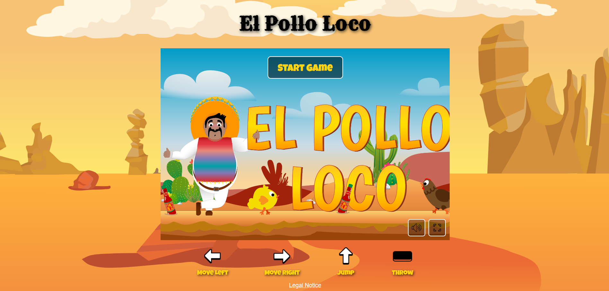

# El Pollo Loco

## Project Goal
A 2D jump-and-run game built with vanilla JavaScript 
and object-oriented programming. Player Pepe collects coins and bottles, fights enemies, and 
defeats a final boss.

## Screenshot

## Built With
- HTML5 (Canvas)
- CSS3
- JavaScript (Vanilla, Object-Oriented)

## Features
- Sprite-Animation 
- Collision detection
- Mobile Controls
- Fullscreen-Mode 
- Mute-Function

## How to Play
- Move: Arrow Left / Right
- Jump: Arrow Up
- Throw bottle: Space
- Mobile: Touch-Buttons

## Getting Started
1. Clone the repository
2. Open `index.html` in a browser

## Credits
See in-game "Legal Notice" dialog for asset attributions.